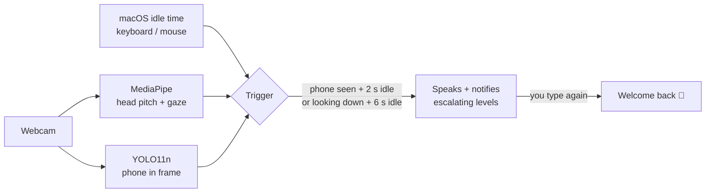

<div align="center">


# on-duty

**Your webcam notices when you stop working and start doomscrolling — and talks you back to your desk.**

Local. Private. Slightly judgmental.


</div>

---

## Install

```bash
curl -fsSL https://raw.githubusercontent.com/valvesss/on-duty-ai/main/install.sh | bash
```

That's it. A setup page opens in your browser and walks you through the rest in about a minute.
Prefer to read the script first? [`install.sh`](install.sh) is short and readable. Or do it by hand:

```bash
git clone https://github.com/valvesss/on-duty-ai && cd on-duty-ai && ./onduty install
```

> Needs macOS and [uv](https://docs.astral.sh/uv/) (the installer gets it for you). When macOS asks, allow **Camera** for *OnDuty*.

## What you get

| | |
|---|---|
| 🧭 **First-run wizard** | Name, language, how hard it should push, your work hours and breaks, voice, and a live camera check. Opens by itself after install. |
| 🎭 **A live stage** | A mascot whose face — and the whole page's mood — escalates with every nag. The line being spoken **types out live** in a speech bubble. |
| 📸 **Shareable moments** | One click turns a moment (or any line from the *Hall of shame*) into a 4:5 "caught red-handed" card for stories and group chats. |
| 😴 **Not always on** | Sleeps — camera light off — when your screen sleeps or locks, outside your work hours, on breaks, or when you've walked away. |
| 📐 **Calibration that adapts** | Zones for each monitor, a personal sensitivity, and automatic detection when you move, dock, or switch camera. |
| 🧠 **Lines that sound like you** | Your AI assistant can write the phrases from what it already knows about you. |
| 🔒 **Private by design** | No cloud, no account, no LLM at runtime. Frames never leave your Mac and are never saved. |

<table>
<tr>
<td width="58%"></td>
<td width="42%"></td>
</tr>
<tr>
<td align="center"><sub>The setup wizard — one question at a time, the mascot follows your cursor</sub></td>
<td align="center"><sub>The shareable card</sub></td>
</tr>
</table>

## How it works



- **Your posture is the baseline.** Head pitch and eye gaze are measured *relative to how you sit while typing*, so camera angle doesn't matter.
- **Phone in frame** (YOLO11n, COCO "cell phone") is an instant signal. It needs Apple Silicon; on Intel the face signal still works.
- **It's built to avoid false alarms.** Decisions use a smoothed pose (a one-frame flip is ignored); eyes alone only count when strongly down; turning your head to another monitor is "looking away", not "down"; and the trigger never sits below your own natural jitter (it's measured while you type and raised automatically).
- **Only typing ends it.** Once it starts, it keeps talking — five levels, gentle → sarcastic → firm → drama → chaos — until you touch the keyboard or mouse again.

### When it sleeps

on-duty isn't a background hog. It drops the camera and goes quiet when:

| Situation | Behavior |
|---|---|
| Screen asleep, locked, or another user's session in front | Camera released, polls every few seconds |
| Outside your work days/hours, or during a break | Camera released, wakes by itself at the next window |
| You paused it (⏸ in the dashboard, or `./onduty pause 60`) | Camera released until it expires |
| No face for 2 min *and* no input for 3 min | Camera released until you touch the Mac |

The dashboard shows each state (and when it's back) instead of going blank.

## The dashboard

Open <http://localhost:4269> and keep it on a second monitor.

- **Live speech bubble** — each line appears as it's spoken.
- **Smooth live camera** (~20 fps; detection runs separately at its own pace) in a straight polaroid, mirrored like a selfie view, with a stamp and a running clock. The **🎥 Camera** menu has *Mirror*, *Blur*, and **Straighten** — sit upright for 3 seconds and it measures your camera's tilt from your eye line and levels the picture.
- **📸 Snap** — builds the shareable card; download, copy, or share. Level 4–5 lines make the button pulse: those are the ones worth posting.
- **Hall of shame** — today's heaviest lines, one tap each from becoming a card.
- History charts, focus streak, and a collapsible panel with the raw signals and the live head-pose radar.
- **⚙** reopens the wizard any time; **⏸** pauses for an hour or until tomorrow.

## Personalize the lines

Out of the box on-duty speaks built-in lines in English or Brazilian Portuguese. To make them about *you*:

1. Open Claude Code (or any AI assistant) in this folder.
2. Say: **"Personalize on-duty's phrases for me."**

The bundled [`on-duty-phrases`](.claude/skills/on-duty-phrases/SKILL.md) skill lists the memory and rules files your other assistants left on your Mac (Claude Code, Cursor, Codex, Gemini, Windsurf, Copilot…), **asks before reading any of them**, mines them for things to joke about — your stack, your projects, your running gags; never secrets or anything private — and writes `~/.on-duty/phrases.json`.

Using another assistant? `./onduty phrases template` prints the schema, `./onduty phrases validate` checks the result.

## Calibration

on-duty works out of the box by learning your posture while you type. For a rounder result, run the 40-second calibration (the wizard offers it; `./onduty recalibrate` or the 📐 button reopens it any time):

1. **Where you look while working** — main screen, second monitor, keyboard/notes, laptop screen. Each place is a *zone* with its own baseline, so glancing at the other monitor never counts as scrolling.
2. **How you look at your phone** — I measure how far your head and eyes drop, and set the trigger half-way between "working" and "phone", scaled by *Relaxed / Normal / Strict*.
3. **Try it** — a live radar shows you (the dot), your zones (green) and where I'd nag (red band), before you save.

While you capture, you get live hints (too dark, too far, off-center, moving) and bad captures are rejected instead of saved.

**It also notices when your setup changes** and asks to recalibrate:

| What changed | What happens |
|---|---|
| Plugged in / unplugged a monitor | New *setup* detected (camera + number of displays + resolution). A banner offers to recalibrate; if you calibrated that setup before (home vs. office), it loads automatically. |
| Switched camera (external webcam, another index) | Same: it's a different setup. The wizard has a **Switch camera** button. |
| Moved the laptop, tilted the screen, new chair | Your typing posture shifts by more than ~9° for a few minutes → "your setup seems to have moved" banner. |
| Slouching through the day | Absorbed silently (up to ±8°) without recalibrating. |
| Dark room, camera covered | A "can't see you" banner instead of silent misses. |

Each setup keeps its own saved calibration in `~/.on-duty/on-duty.db`.

### Teach it when it's wrong

Two buttons keep it honest. **🙅 I wasn't on my phone** (on the stage while it nags) stops the nag, pauses it for a minute and makes the trigger more relaxed; **📱 You missed one** (in the dashboard's details) makes it stricter. The adjustment is saved per setup and reset when you recalibrate.

## Commands

```text
./onduty install | uninstall      install / remove the background service (starts at login)
./onduty start | stop | restart   control it
./onduty open                     open the dashboard
./onduty setup                    reopen the setup wizard
./onduty recalibrate              recalibrate for this desk / monitors / camera
./onduty pause 60 | tomorrow | 0  pause for N minutes, until tomorrow, or resume
./onduty status | logs | stats    what's it doing, tail the log, summary from the local database
./onduty doctor                   check your setup
./onduty test                     run the unit tests
./onduty phrases template | validate | sources
```

## Configuration

Everything lives in `~/.on-duty/config.json` and is editable from the wizard.

| Key | Default | |
|---|---|---|
| `name` | `""` | Used in lines (`{name}`); lines that need it are skipped when empty |
| `lang` | `pt_BR` | `pt_BR` or `en_US` — voice and lines |
| `tone` | `balanced` | `friendly` · `balanced` · `ruthless` · `chaos` |
| `voice` / `voice_on` | default / `true` | Any macOS voice; off = notifications and dashboard only |
| `schedule` | Mon–Fri 09:00–18:00, break 12:00–13:30 | `"enforce": false` = always on |
| `camera` | `0` | Camera index (the wizard's *Switch camera* button changes it) |
| `mirror` | `true` | Selfie-style preview (detection always uses the raw image) |
| `rotate` | `0` | Degrees to straighten a tilted camera (set by *Straighten*) |
| `phone_detection` | `true` | The YOLO phone detector |
| `retention_days` | `365` | Events older than this are deleted at startup (`0` = keep forever) |
| `port` | `4269` | Dashboard at `http://localhost:<port>` (restart after changing) |
| `custom_phrases_only` | `false` | Use only your `phrases.json` instead of mixing with the built-ins |
| `thresholds` | see [`config.py`](config.py) | Head/gaze sensitivity, idle seconds, YOLO confidence |

Your data (events and posture calibration) stays in `~/.on-duty/on-duty.db`, a plain SQLite file. Its schema is versioned (`PRAGMA user_version`) and upgrades itself on start.

## Troubleshooting

<details><summary><b>The camera check says "waiting for permission"</b></summary>

Allow **OnDuty** in *System Settings › Privacy & Security › Camera*. The wizard keeps retrying. If it's not listed, run `./onduty restart`.
</details>

<details><summary><b>It nags while I'm clearly working</b></summary>

It needs a few seconds of typing to learn your posture after install. If it still misfires, raise `pitch_delta` or `down_ratio` in `config.json` (thresholds), or restart after changing your camera position drastically.
</details>

<details><summary><b>It doesn't see my phone</b></summary>

Phone detection needs Apple Silicon and decent light. Check `./onduty doctor`, and make sure the phone is visible in the wizard's camera step.
</details>

<details><summary><b>Does anything leave my Mac?</b></summary>

No. Frames are processed in memory, the dashboard only listens on `127.0.0.1`, and there is no telemetry. The only downloads happen at install: Python packages and the two model files.
</details>

<details><summary><b>Uninstall</b></summary>

`./onduty uninstall`, then delete the folder and `~/.on-duty`.
</details>

## Under the hood

Python 3.12 · [MediaPipe](https://ai.google.dev/edge/mediapipe) Face Landmarker · [Ultralytics](https://github.com/ultralytics/ultralytics) YOLO11n · macOS `say`, `ioreg` and CoreGraphics · a single-file dashboard and wizard in plain HTML/JS (no build step) · a LaunchAgent that starts it at login.

## License

[MIT](LICENSE) © Vitor Alves
